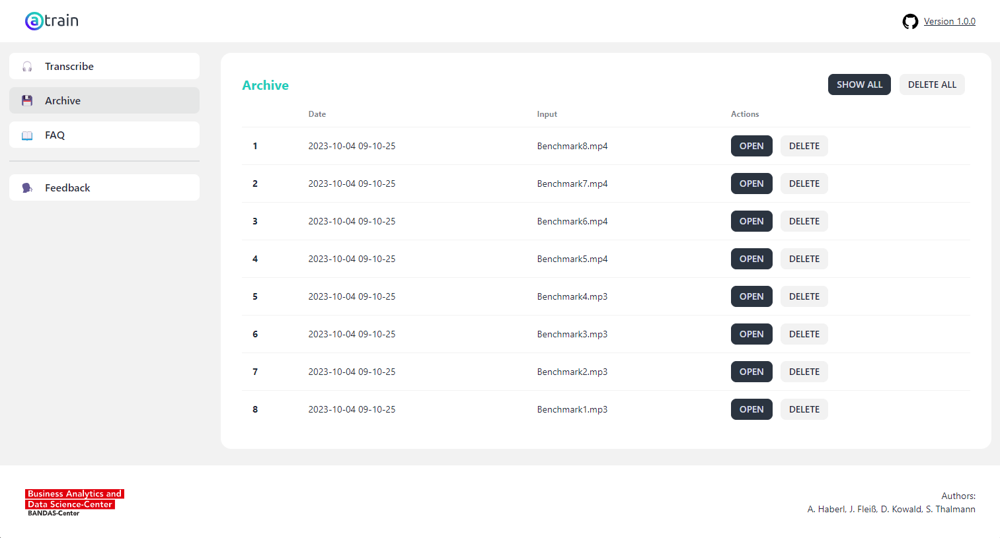

## Accessible Transcription of Interviews
aTrain is a tool for automatically transcribing speech recordings utilizing state-of-the-art machine learning models without uploading any data. It was developed by researchers at the Business Analytics and Data Science-Center at the University of Graz and tested by researchers from the Know-Center Graz. 

Big News! The paper introducing aTrain has been published in the Journal of Behavioral and Experimental Finance. Please now cite the published paper if you used aTrain for your research: [Take the aTrain. Introducing an Interface for the Accessible Transcription of Interviews.](https://www.sciencedirect.com/science/article/pii/S2214635024000066)

Windows (10 and 11) users can install aTrain via the Microsoft app store ([Link](https://apps.microsoft.com/store/detail/atrain/9N15Q44SZNS2)) or by downloading the installer from the BANDAS-Center Website ([Link](https://business-analytics.uni-graz.at/de/forschen/atrain/download/)).

For Linux, follow the [instructions](https://github.com/JuergenFleiss/aTrain/wiki/Linux-Support-(in-progress)) in our Wiki.

aTrain offers the following benefits:
\
\
**Fast and accurate 🚀**
\
aTrain provides a user friendly access to the [faster-whisper](https://github.com/guillaumekln/faster-whisper) implementation of OpenAI’s [Whisper model](https://github.com/openai/whisper), ensuring best in class transcription quality (see [Wollin-Geiring et al. 2023](https://www.static.tu.berlin/fileadmin/www/10005401/Publikationen_sos/Wollin-Giering_et_al_2023_Automatic_transcription.pdf)) paired with higher speeds on your local computer. Transcription when selecting the highest-quality model takes only around three times the audio length on current mobile CPUs typically found in middle-class business notebooks (e.g., Core i5 12th Gen, Ryzen Series 6000).
\
\
**Speaker detection 🗣️**
\
aTrain has a speaker detection mode based on [pyannote.audio](https://github.com/pyannote/pyannote-audio) and can analyze each text segment to determine which speaker it belongs to.
\
\
**Privacy Preservation and GDPR compliance 🔒**
\
aTrain processes the provided speech recordings completely offline on your own device and does not send recordings or transcriptions to the internet. This helps researchers to maintain data privacy requirements arising from ethical guidelines or to comply with legal requirements such as the GDRP.
\
\
**Multi-language support 🌍**
\
aTrain can process speech recordings in any of the following 57 languages: Afrikaans, Arabic, Armenian, Azerbaijani, Belarusian, Bosnian, Bulgarian, Catalan, Chinese, Croatian, Czech, Danish, Dutch, English, Estonian, Finnish, French, Galician, German, Greek, Hebrew, Hindi, Hungarian, Icelandic, Indonesian, Italian, Japanese, Kannada, Kazakh, Korean, Latvian, Lithuanian, Macedonian, Malay, Marathi, Maori, Nepali, Norwegian, Persian, Polish, Portuguese, Romanian, Russian, Serbian, Slovak, Slovenian, Spanish, Swahili, Swedish, Tagalog, Tamil, Thai, Turkish, Ukrainian, Urdu, Vietnamese, and Welsh.
\
\
**MAXQDA, ATLAS.ti and NVivo compatible output 📄**
\
aTrain provides transcription files that are seamlessly importable into the most popular tools for qualitative analysis, ATLAS.ti, MAXQDA and NVivo. This allows you to directly play audio for the corresponding text segment by clicking on its timestamp. Go to the [tutorial](https://github.com/BANDAS-Center/aTrain/wiki/Tutorials).
\
\
**Nvidia GPU support 🖥️**
\
aTrain can either run on the CPU or an NVIDIA GPU (CUDA toolkit installation required). A [CUDA-enabled NVIDIA GPU](https://developer.nvidia.com/cuda-gpus) significantly improves the speed of transcriptions and speaker detection, reducing transcription time to 20% of audio length on current entry-level gaming notebooks.

| Screenshot 1 | Screenshot 2 |
| --- | --- |
|  |  |

## Benchmarks
For testing the processing time of aTrain-core we transcribe a [conversation between Christine Lagarde and Andrea Enria at the Fifth ECB Forum on Banking Supervision 2023](https://www.youtube.com/watch?v=kd7e3OXkajY) published on YouTube by the European Central Bank under a Creative Commons license , downloaded as 320p MP4 video file. The file has a duration of exactly 22 minutes and was transcribed on different computing devices with speaker detection enabled. The figure below shows the processing time of each transcription.

Transcription Time for 00:22:00 File:
| Computing Device       |  large-v3   | Distil large-v3   |
| ---                    | ---         | ---               |
| CPU: Ryzen 6850U       | 00:33:02    | 00:13:30          |
| CPU: Apple M1          | 00:33:15    | 00:21:40          |
| CPU: Intel i9-10940X   | 00:10:25    | 00:04:36          |
| GPU: RTX 2080 Ti       | 00:01:44    | 00:01:06          |

## System requirements
Windows is fully supported. 

Debian support with manual installation [Wiki instructions](https://github.com/JuergenFleiss/aTrain/wiki/Linux-Support-(in-progress)) 

Currently no MacOS support.

If you want to use Windows Server, ensure that WebView2 is installed:  
https://developer.microsoft.com/en-us/microsoft-edge/webview2/#download 

## Installation for users 😎
Simply access the installer from the Microsoft app store  
https://apps.microsoft.com/store/detail/atrain/9N15Q44SZNS2

## Installation for developers ⚙️

**You need to have python >=3.10**  
If you need help with installing that, look at these resources:  
https://www.python.org/downloads/release/python-31011/

Setup a virtual environment
```
python -m venv venv
```
Activate the virtual environment
```
.\venv\Scripts\activate
```
Install aTrain
```
pip install aTrain@git+https://github.com/JuergenFleiss/aTrain.git --extra-index-url https://download.pytorch.org/whl/cu121
```
Download ffmpeg and all required models from Whisper and pyannote.audio with a console script
Note: The user version in the Microsoft store has those assets already included. 
```
aTrain init
```
Run the app with the console script
```
aTrain start
```

## Roadmap and Upcoming Features

Planned in the near future.
- Batch Processing, allowing to have files queued for transcription
- More distilled-whisper models for German and other languages
- Stable Debian and MacOS installers


## How to build a standalone executable 📦
We use pyinstaller to freeze the code of aTrain and create a standalone executable.  
**If you want to create your own code package follow these steps:**  
\
Clone and install aTrain in **editable mode** 
```
git clone https://github.com/JuergenFleiss/aTrain.git
cd aTrain
pip install -e . --extra-index-url https://download.pytorch.org/whl/cu121
```
\
Download ffmpeg and all required models from Whisper and pyannote.audio with a console script
```
aTrain init
```
Install pyinstaller
```
pip install pyinstaller
```
Build the executable using the provided instruction in the file "build.spec"
```
pyinstaller build.spec
```
Congratulations! You just built a standalone executable for aTrain.  
\
To open this version of aTrain just go to the output folder (./dist/aTrain) and open the executable (e.g. aTrain.exe for Windows).  
\
If you want to go a step further and create an MSIX-installer for aTrain you can use [Advanced Installer Express](https://www.advancedinstaller.com/express-edition.html).  
For information on how to use Advanced Installer Express refer to their [documentation](https://www.advancedinstaller.com/user-guide/introduction.html).

## Attribution
The GIFs and Icons in aTrain are from [tenor](https://tenor.com/) and [flaticon](https://www.flaticon.com/). 
