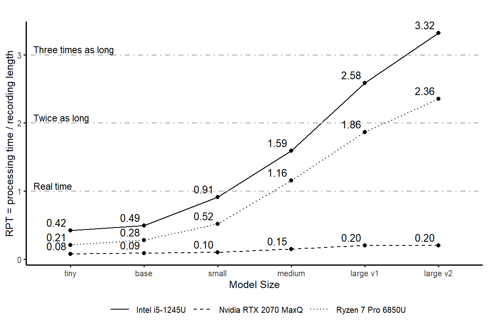
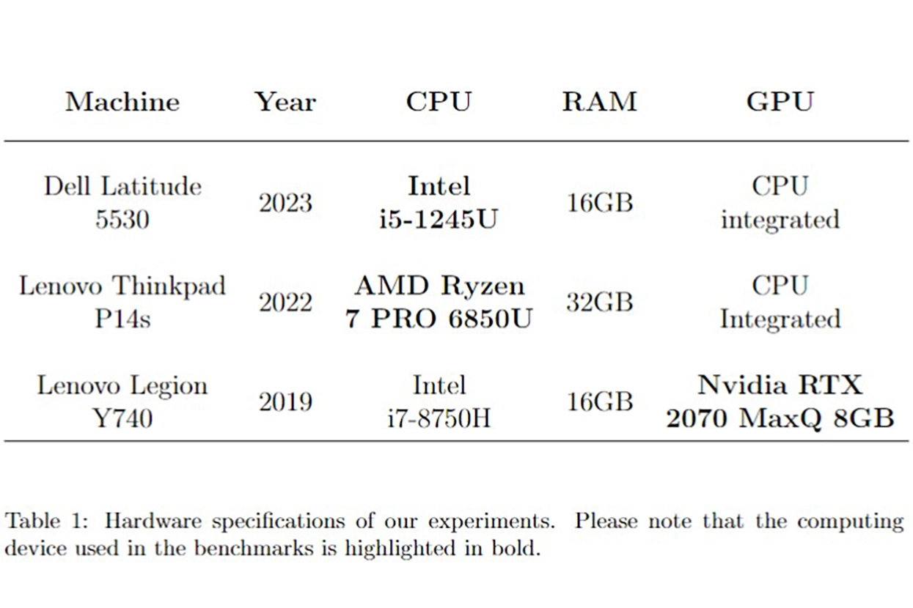

## Accessible Transcription of Interviews
aTrain is a tool for automatically transcribing speech recordings utilizing state-of-the-art machine learning models without uploading any data. It was developed by researchers at the Business Analytics and Data Science-Center at the University of Graz and tested by researchers from the Know-Center Graz. 

It can be installed via the Microsoft app store: https://apps.microsoft.com/store/detail/atrain/9N15Q44SZNS2

aTrain offers the following benefits:
\
\
**Fast and accurate 🚀**
\
aTrain provides a user friendly access to the [faster-whisper](https://github.com/guillaumekln/faster-whisper) implementation of OpenAI’s [Whisper model](https://github.com/openai/whisper), ensuring best in class transcription quality (see [Wollin-Geiring et al. 2023](https://www.static.tu.berlin/fileadmin/www/10005401/Publikationen_sos/Wollin-Giering_et_al_2023_Automatic_transcription.pdf)) paired with higher speeds on your local computer. Transcription when selecting the highest-quality model takes only around three times the audio length on current mobile CPUs typically found in middle-class business notebooks (e.g., Core i5 12th Gen, Ryzen Series 6000).
\
\
**Speaker detection 🗣️**
\
aTrain has a speaker detection mode based on [pyannote.audio](https://github.com/pyannote/pyannote-audio) and can analyze each text segment to determine which speaker it belongs to.
\
\
**Privacy Preservation and GDPR compliance 🔒**
\
aTrain processes the provided speech recordings completely offline on your own device and does not send recordings or transcriptions to the internet. This helps researchers to maintain data privacy requirements arising from ethical guidelines or to comply with legal requirements such as the GDRP.
\
\
**Multi-language support 🌍**
\
aTrain can process speech recordings in any of the following 57 languages: Afrikaans, Arabic, Armenian, Azerbaijani, Belarusian, Bosnian, Bulgarian, Catalan, Chinese, Croatian, Czech, Danish, Dutch, English, Estonian, Finnish, French, Galician, German, Greek, Hebrew, Hindi, Hungarian, Icelandic, Indonesian, Italian, Japanese, Kannada, Kazakh, Korean, Latvian, Lithuanian, Macedonian, Malay, Marathi, Maori, Nepali, Norwegian, Persian, Polish, Portuguese, Romanian, Russian, Serbian, Slovak, Slovenian, Spanish, Swahili, Swedish, Tagalog, Tamil, Thai, Turkish, Ukrainian, Urdu, Vietnamese, and Welsh.
\
\
**MAXQDA and ATLAS.ti compatible output 📄**
\
aTrain provides transcription files that are seamlessly importable into the most popular tools for qualitative analysis, ATLAS.ti and MAXQDA. This allows you to directly play audio for the corresponding text segment by clicking on its timestamp.
\
\
**Nvidia GPU support 🖥️**
\
aTrain can either run on the CPU or an NVIDIA GPU (CUDA toolkit installation required). A [CUDA-enabled NVIDIA GPU](https://developer.nvidia.com/cuda-gpus) significantly improves the speed of transcriptions and speaker detection, reducing transcription time to 20% of audio length on current entry-level gaming notebooks.

| Screenshot 1 | Screenshot 2 |
| --- | --- |
|  |  |

## Benchmarks
For testing the processing time of aTrain we transcribed an audiobook ("[The Snow Queen](https://ia802608.us.archive.org/33/items/andersens_fairytales_librivox/fairytales_06_andersen.mp3)" from Hans Christian Andersen with a duration of 1 hour, 13 minutes, and 38 seconds) with three different computers (see table 1). The figure below shows the processing time of each transcription relative to the length of the speech recording. In this relative processing time (RPT), a transcription is considered ’real time’ when the recording length and the processing time are equal. Subsequently, faster transcriptions lead to an RPT below 1 and slower transcriptions to an RPT time above 1.

| Benchmark results | Used hardware |
| --- | --- |
|  |  |

## System requirements
You need a Windows system.
No Linux or MacOS support.

## Installation for users 😎
Simply access the installer from the Microsoft app store  
https://apps.microsoft.com/store/detail/atrain/9N15Q44SZNS2

## Installation for developers ⚙️

**You need to have python >=3.10 and git installed**  
If you need help with installing that, look at these resources:  
https://www.python.org/downloads/release/python-31011/  
https://git-scm.com/download/win/  

Clone this repo
```
git clone https://github.com/BANDAS-Center/aTrain.git
```
Change directory into aTrain
```
cd aTrain
```
Setup the virtual environment
```
python -m venv venv
```
Activate the virtual environment
```
.\venv\Scripts\activate
```
Install dependencies
```
pip install -r requirements.txt
```
Run the app
```
python app.py
```
Note: The developer version of aTrain will download ffmpeg and the Whisper models during the first transcription. The user version in the Microsoft store has those assets already included. 
## Attribution
The GIFs and Icons in aTrain are from [tenor](https://tenor.com/) and [flaticon](https://www.flaticon.com/). 
